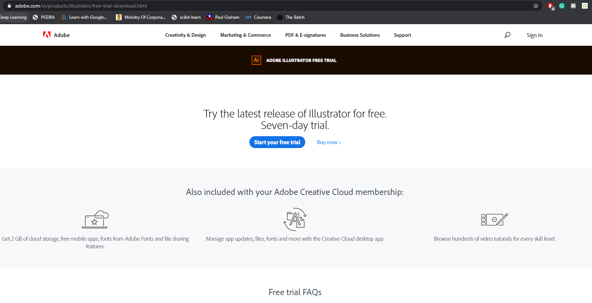
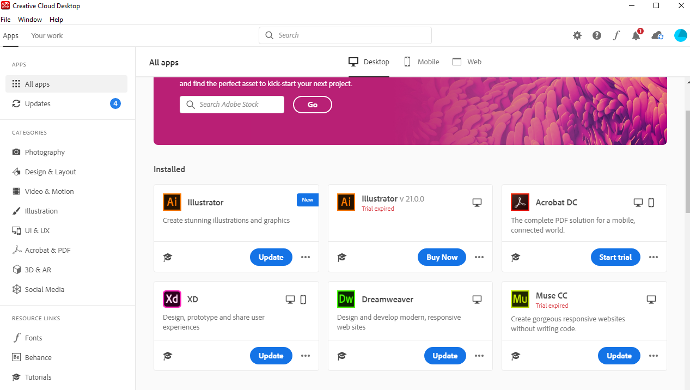

# Adobe Illustrator

## Installing Adobe Illustrator

1. Go to the link https://www.adobe.com/in/products/illustrator/free-trial-download.html and select "Start your free trial".

2. The page will get redirected to https://creativecloud.adobe.com/apps/download/illustrator
3. **"Illustrator_Set-Up.exe"** will get downloaded.
4. Run **"Illustrator_Set-Up.exe"**
5. Paste the file **"amtlib.dll"** in the directory where **Adobe Illustrator** is installed.
6. At first, it won't show that 
At the end after a 7 day trial you may find 2 Illustrators in which one would be activated and ready for use. 
